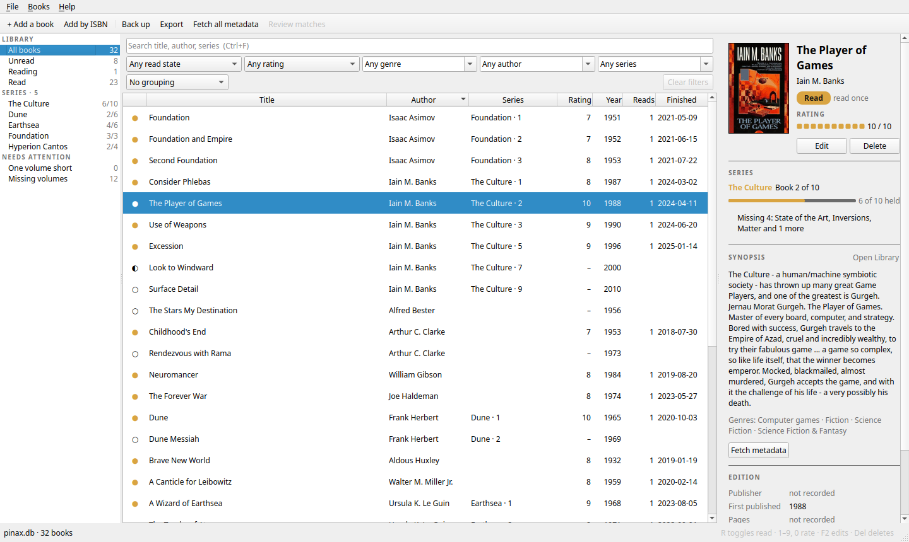
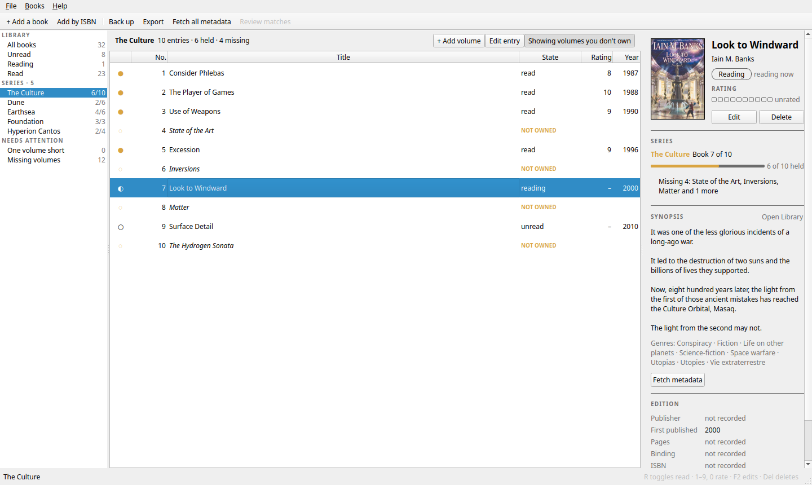
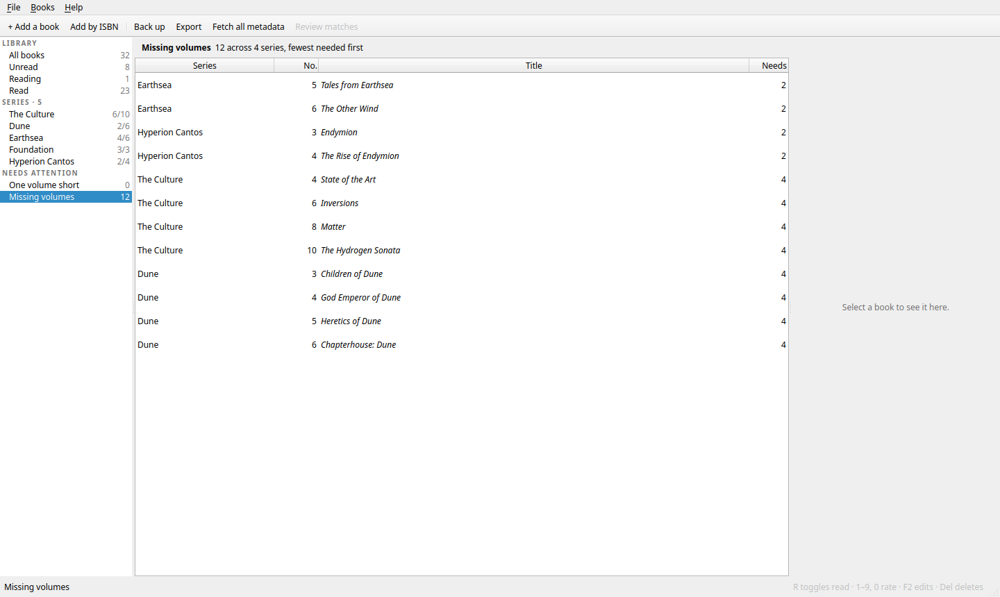
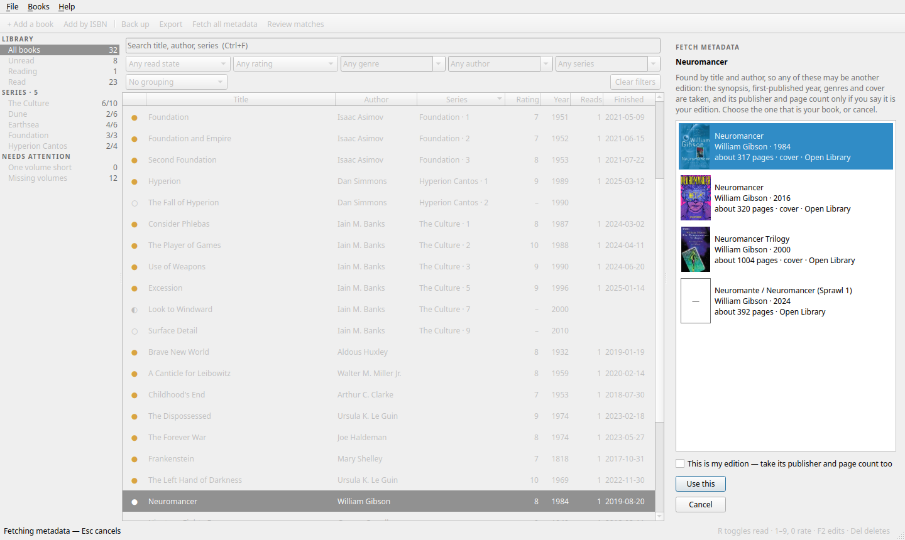
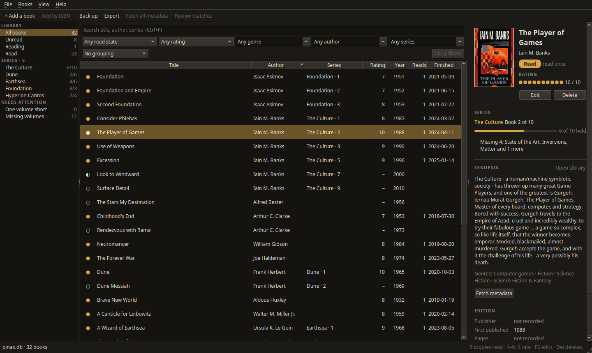

# Pinax

**A home for your bookshelf, on your own computer.**

Pinax is a Linux desktop app for keeping track of the books you own: what
you've read, what's waiting on the pile, how you rated each one, and, most
of all, which books your series are still missing. It looks up synopses,
covers and genres for you, and everything stays in one file on your own
machine.



*Named for the* Pinakes, *Callimachus's catalogue of the Library of
Alexandria.*

---

## What it does

- **Keeps your library in one place.** Every book you own, with what you
  thought of it: read or unread, how many times, and a rating out of ten.
- **Knows your series.** Each series shows the volumes you have and the ones
  you don't, in order. A **shopping list** gathers every missing volume, with
  the series closest to complete first.
- **Fills in the details.** Synopses, cover art and genres come from Open
  Library and the British Library, and from Google Books if you have an API
  key. You choose the right edition, and nothing you typed yourself is ever
  overwritten.
- **Names the books you're missing.** **Find titles** looks a series up and
  tells you what its missing volumes are called, so you know what to look
  for in the shop.
- **Adds books by ISBN.** Type the number from the back cover and check the
  card before it goes in.
- **Finds anything fast.** Sort, filter, group and search: unread Pratchett,
  or space opera rated eight or more.
- **Keeps it safe.** Back up in a click, and export to Excel, CSV or plain
  SQL whenever you like.
- **Light or dark.** Your desktop's look, or Pinax's own light and dark
  themes.

---

## A look around

<table>
  <tr>
    <td width="50%"></td>
    <td width="50%"></td>
  </tr>
  <tr>
    <td><b>A series</b>: the volumes you don't own sit in their place.</td>
    <td><b>The shopping list</b>: every missing volume, nearest to complete first.</td>
  </tr>
  <tr>
    <td></td>
    <td></td>
  </tr>
  <tr>
    <td><b>Fetch metadata</b>: pick your edition by its cover.</td>
    <td><b>The dark theme</b>, after the original design.</td>
  </tr>
</table>

The screenshots show a demo catalogue of well-known books.

---

## Getting started

Pinax builds on Linux with Qt 6. On Linux Mint or Ubuntu:

```sh
sudo apt install g++ cmake ninja-build qt6-base-dev libsqlite3-dev libxlsxwriter-dev pkg-config
cmake -B build -G Ninja -DCMAKE_BUILD_TYPE=Release
cmake --build build -j
build/src/pinax
```

Pinax creates an empty catalogue the first time it runs. Add books one at a
time (Ctrl+N), by ISBN (Ctrl+I), or bring a whole spreadsheet in with
**File ▸ Import ▸ Books from CSV**.

---

## Learn more

- **[User guide](docs/USER_GUIDE.md)**: every feature, keyboard shortcuts,
  backups and the command line.
- **[Developer notes](docs/DEVELOPER.md)**: how it's built, the project's
  layout, the data model and the documentation map.
- **[Build details](BUILD.md)**: verified versions and troubleshooting.

---

## Project status

> **Status:** Active
> **Provenance:** Shane Hartley (author); Claude (primary auditor)
> **Last reviewed:** 2026-10-10
> **Why this status:** Phases 1 to 4 are complete, so everything above works
> today. Phase 5, adding books by scanning their barcode with a webcam,
> waits on a camera. Toolchain fixed by D-001.

What's done and what's next is in the [roadmap](ROADMAP.md), and the
[changelog](CHANGELOG.md) lists every change.

## Licence

Pinax is free and open source under the [MIT licence](LICENSE): use it,
change it and share it, keeping the copyright notice.
