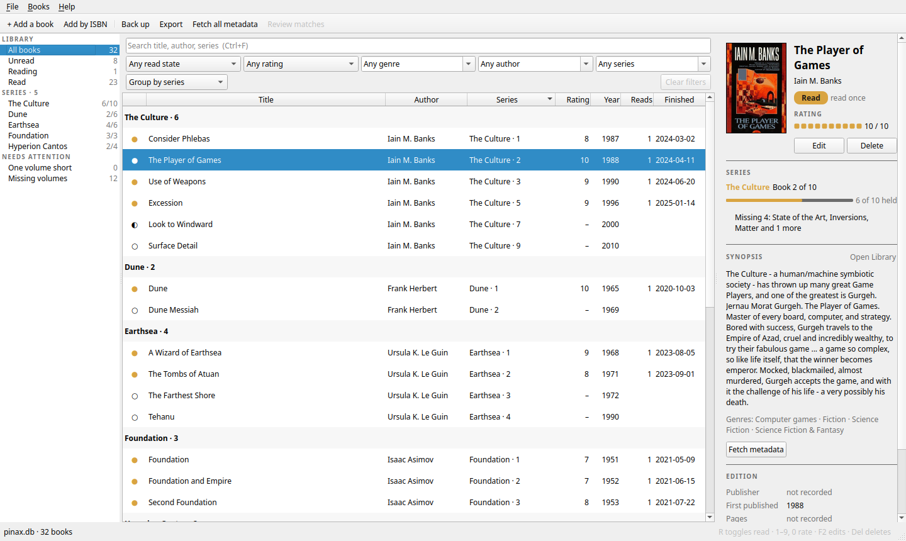

# Using Pinax

A tour of everything Pinax does, in the order you are likely to meet it. For
building and the project's internals, see [DEVELOPER.md](DEVELOPER.md).

---

## Your catalogue

Pinax keeps your library in one file, a *catalogue*. On first run it creates
`~/.local/share/pinax/pinax.db`; after that it opens whichever catalogue you
last had open. You can also name one when starting it:

```sh
build/src/pinax ~/Books/library.db
```

The **File** menu creates, opens and closes catalogues, and **Open Recent**
lists the last few. A catalogue made by an older Pinax is upgraded in place
when it is opened. Pinax refuses to open a file that is not a catalogue,
rather than change someone else's database.

---

## Getting your books in

- **By hand:** **Add a book** (Ctrl+N) opens an empty form in the panel.
- **By ISBN:** **Add by ISBN** (Ctrl+I) looks a book up by the number on its
  back cover and shows a card to check before anything is added. If you
  already have that book without an ISBN, Pinax gives yours the number
  rather than adding it twice.
- **From a spreadsheet:** **File ▸ Import ▸ Books from CSV** merges a CSV file
  into the open catalogue, after backing it up. The format is in
  [SPEC.md §1](../SPEC.md). Importing the same file twice changes nothing.
- **A series' contents:** `pinax --import-series series.csv` records the
  volumes each series contains, including the ones you don't own
  ([SPEC.md §1.6](../SPEC.md)).

---

## Finding your way around

The window has three parts:

- **The rail** on the left narrows the list: all books, unread, reading or
  read; one series; or the volumes you still need.
- **The list** in the middle can be sorted by clicking any column header.
  Above it:
  - **Filters** for read state, rating, genre, author and series combine, so
    you can ask for unread Pratchett, or space opera rated eight or more.
    **Clear filters** shows everything again.
  - **Search** (Ctrl+F) finds books by any words of their title, authors or
    series, as you type.
  - **Group by** puts the list under headings for each series, author or
    genre, with a count under each.
- **The panel** on the right shows whatever you have selected: a book's cover,
  rating, series and synopsis, or a series' progress.



---

## Reading and rating

With books selected in the list:

| Key | Does |
|---|---|
| R | Marks read, or unread again |
| 1–9 | Rates out of ten (0 rates ten) |
| Backspace or − | Clears the rating |
| Delete | Deletes, after asking in the panel |
| F2 | Edits the book in the panel |

The rating squares in the panel can be clicked too. Marking a book read counts
a read and dates it. The edit form takes a finish date for books you read
before you used Pinax.

---

## Series

Choosing a series in the rail opens its page: every volume in order, with the
ones you don't own shown in place and marked **NOT OWNED**. From there you
can:

- **Add volume:** record a volume the series contains.
- **Edit entry:** change a volume's position or title.
- **Mark as owned:** on a missing volume, attach a book you already have, or
  add it as a new book.
- **Find titles:** look the series up on Wikidata, or Open Library if
  Wikidata doesn't know it, and name the volumes you know are missing but
  haven't identified. Volumes the series doesn't list yet are offered too.
  You tick the right ones before anything changes.

Positions are kept exactly as printed, such as `Broadcast 6.5`, `1-4` or
`3a`, and still sort in the right order.

**NEEDS ATTENTION** in the rail is your shopping list: every volume your
series lack, with those one volume short of complete first.

---

## Synopses, covers and genres

- **Fetch metadata**, in the panel, looks the selected book up on Open
  Library, by ISBN or by title and author. For an ISBN it also asks the
  British Library, which fills in UK editions' page counts and original
  years. It shows what it found, each candidate with its cover; resting the
  pointer on a cover enlarges it. Choosing one brings a synopsis, genres and
  a cover.
- **This is my edition**, ticked when choosing, also takes that edition's
  publisher and page count.
- **Fetch all metadata**, in the toolbar, does the same for every book not yet
  looked up. It takes an ISBN's matching answer by itself. Anything it found
  by title waits under **Review matches**, for you to confirm one book at a
  time. It can be stopped and started again, and carries on where it left off.

A fetch only fills in what you left empty. A synopsis or cover you entered
yourself is never replaced.

### Google Books

Google Books is asked as well if you have an API key. Put it in a file called
`google-books.key`, beside the catalogue or in the folder Pinax is started
from, or in the `PINAX_GOOGLE_BOOKS_KEY` environment variable. Never commit
it: `.gitignore` already covers `*.key`.

---

## Appearance

**View ▸ Theme** switches between your desktop's look and Pinax's own light
and dark themes, at once, and remembers your choice.

---

## Backing up, restoring and exporting

- **Back up** (Ctrl+B) writes a checked copy of the catalogue wherever you
  choose, without closing it.
- **Restore from Backup**, in the File menu, puts a backup back. The
  catalogue open at the time is backed up first.
- **Export** (Ctrl+E) writes one of:
  - an **Excel workbook**, with sheets for books, series status and authors;
  - a **CSV** of the books the list shows, in the format the importer reads;
  - an **SQL dump**: the whole catalogue as plain text, readable and fit
    for version control, which rebuilds it with nothing but `sqlite3`.
- **File ▸ Import ▸ Catalogue from SQL Dump** rebuilds a catalogue from such
  a dump.

> **Don't back up by copying `pinax.db` while Pinax is open.** The newest
> changes live in `pinax.db-wal` beside it, and a plain copy can miss them.
> Use Back up, or `pinax --backup`, which checks the copy.

---

## From the command line

Each of these runs without opening the window, then exits:

| Command | Does |
|---|---|
| `pinax --backup <file>` | Writes a checked backup, for a script or a cron job |
| `pinax --dump <file>` | Writes the SQL dump (`-` for standard output) |
| `pinax --xlsx <file>` | Writes the Excel workbook |
| `pinax --csv <file>` | Writes every book as CSV |

These two import, then open the window:

| Command | Does |
|---|---|
| `pinax --import books.csv` | Imports books |
| `pinax --import-series series.csv` | Imports what each series contains |

Any of them can be preceded by a catalogue's path; otherwise the last one
open is used.

---

## Keyboard shortcuts

| Keys | Does |
|---|---|
| Ctrl+N | Add a book |
| Ctrl+I | Add by ISBN |
| Ctrl+F | Search |
| F2 | Edit the selected book |
| R | Read / unread |
| 1–9, 0 | Rate (0 is ten) |
| Backspace | Clear the rating |
| Delete | Delete the selected books |
| Ctrl+B | Back up |
| Ctrl+E | Export |
| Ctrl+Shift+N | New catalogue |
| Ctrl+O | Open catalogue |
| Ctrl+W | Close catalogue |
| Ctrl+Q | Quit |
| Esc | Cancel whatever the panel is asking |
